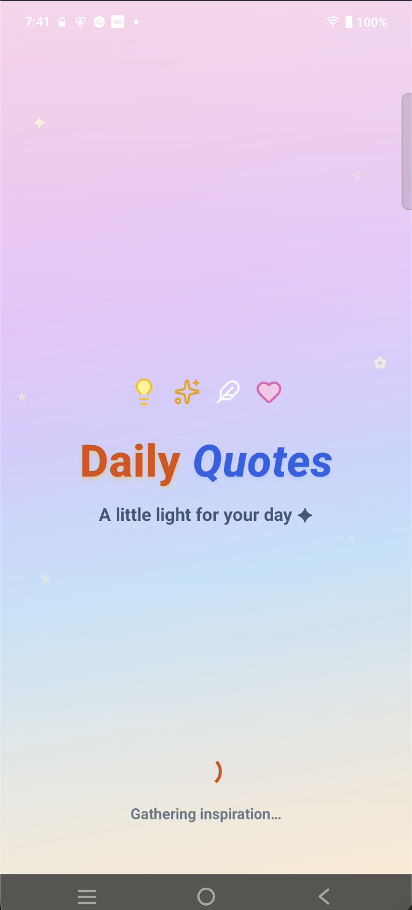
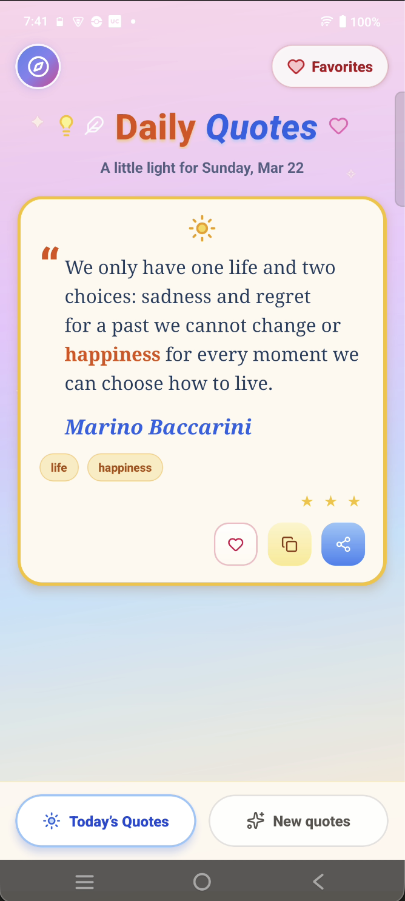
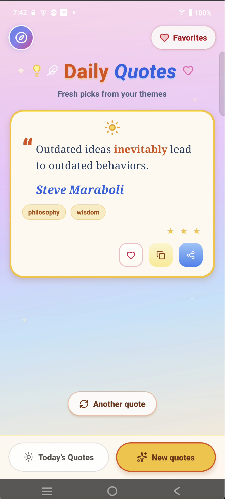
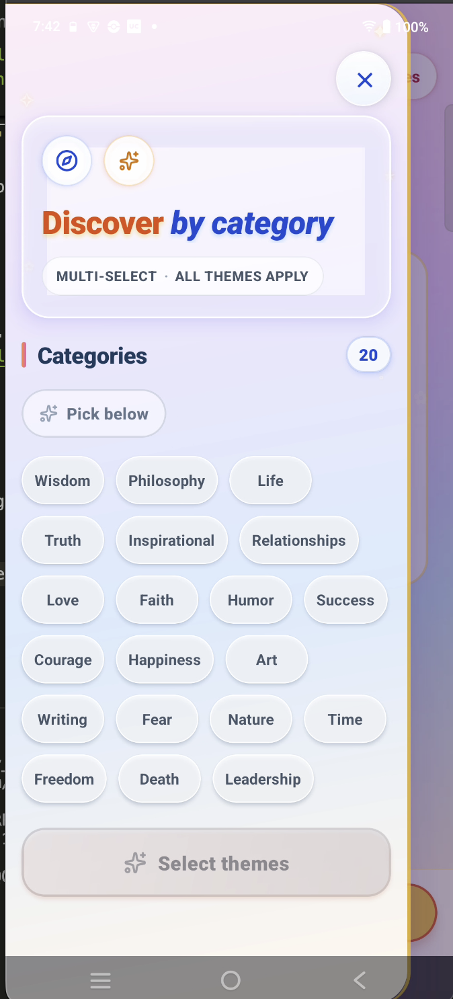
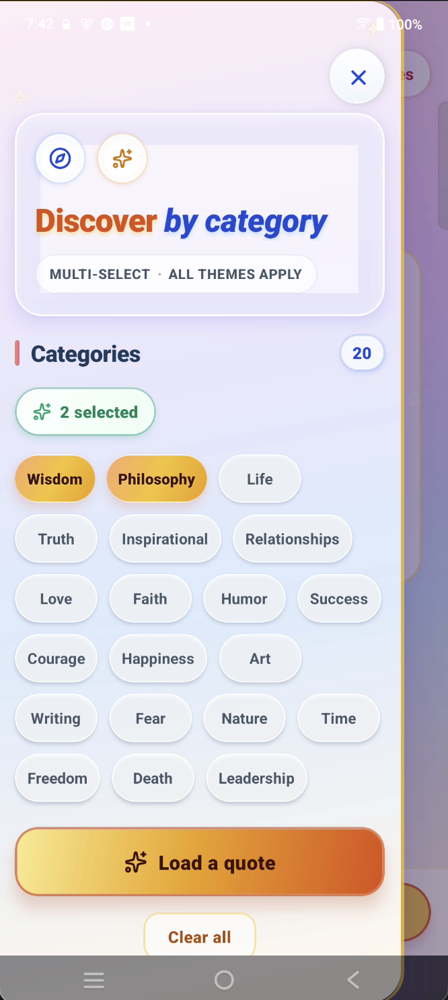
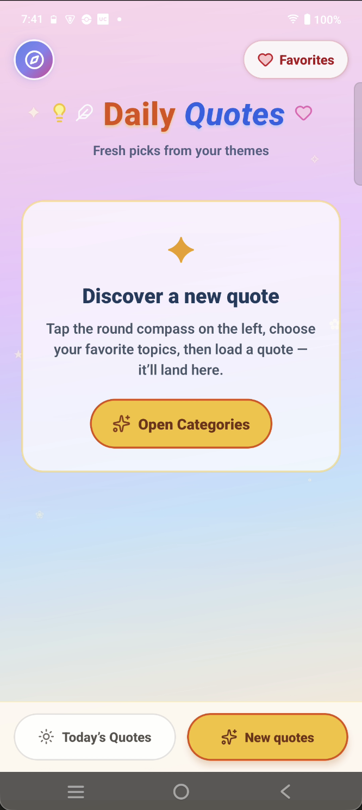
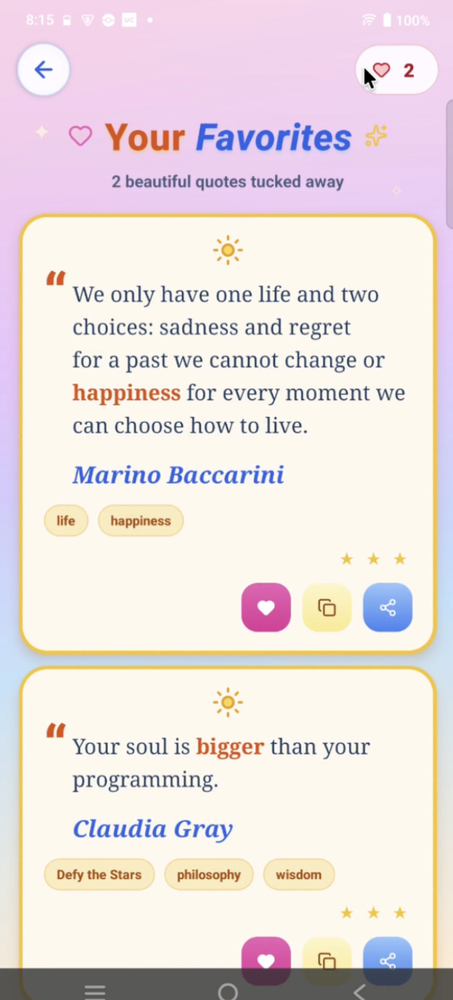
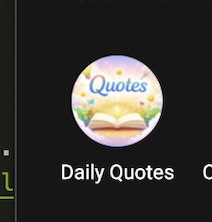

# Daily Quote — Screenshots & demo

This folder contains **screenshots**, the **screen recording**, and related assets for [Daily Quote](../../README.md).  
The [main project README](../../README.md) embeds images and the demo video in the **Screenshots** section.

---

## Demo recording

<p align="center">
  <video src="./Video.mov" controls width="320" playsInline>
    <a href="./Video.mov">Open Video.mov</a>
  </video>
</p>

| File | What it is |
|------|------------|
| `Video.mov` | In-app screen recording (demo walkthrough) |

**Link:** [Video.mov](./Video.mov)

---

## Files in this folder

| File | What it shows |
|------|----------------|
| `splash_screen.png` | Splash / launch experience |
| `home_screen.png` | Home screen with the daily quote card |
| `get_quotes.png` | Flow or UI related to loading quotes |
| `categories.png` | Categories / discover-by-category UI |
| `selected_categories.png` | Category chips with selections |
| `new_quotes_by_categories_wise.png` | Quote loaded using category filters |
| `favourite_screen.png` | Favorites list screen |
| `app_icon.png` | App icon asset (marketing) |

---

## Preview (this folder)

<p align="center">
  <br />
  <sub>Splash</sub>
</p>

<p align="center">
  
  &nbsp;
  
</p>

<p align="center">
  
  &nbsp;
  
</p>

<p align="center">
  
  &nbsp;
  
</p>

<p align="center">
  
</p>

---

## Adding or replacing assets

1. **Images:** export **PNG** (or JPG and update extensions in the [root README](../../README.md) if you switch format).
2. **Video:** keep the name `Video.mov` or update both READMEs and the `<video src="…">` paths to match your filename.
3. Prefer **no spaces** in filenames (easier for Git and Markdown). `.mov` / `.mp4` over **~100MB** may require [Git LFS](https://git-lfs.com/) on GitHub.
4. Commit from the repo root:

   ```bash
   git add docs/screenshots/
   git commit -m "Update screenshots or demo video"
   ```

5. If you add a new screenshot to the repo home page, add an `` line in the **Screenshots** section of [`README.md`](../../README.md).
